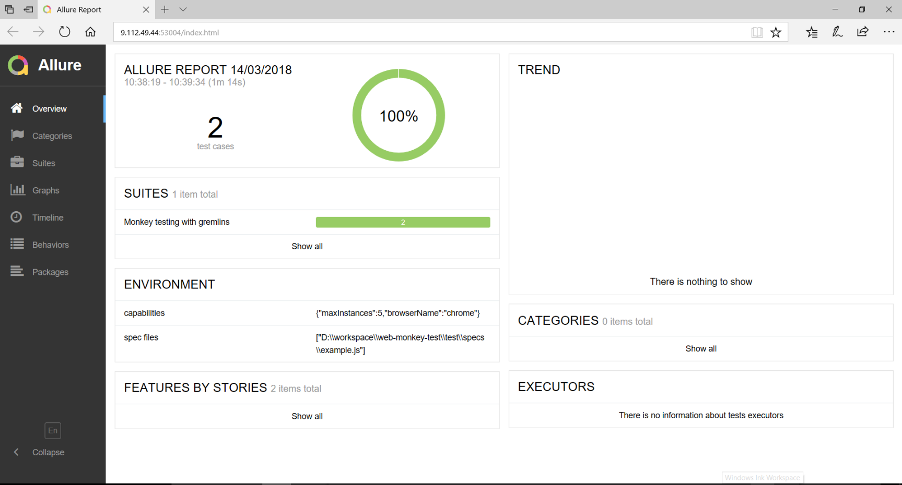

# web-monkey-test
This is a generic monkey test framework base on webdriverio and gremlins.js. Use it to check the robustness of web applications by unleashing a horde of undisciplined gremlins.

## About Gremlins.js
While developing an HTML5 application, did you anticipate uncommon user interactions? Did you manage to detect and patch all memory leaks? If not, the application may break sooner or later. If n random actions can make an application fail, it's better to acknowledge it during testing, rather than letting users discover it.

Gremlins.js simulates random user actions: gremlins click anywhere in the window, enter random data in forms, or move the mouse over elements that don't expect it. Their goal: triggering JavaScript errors, or making the application fail. If gremlins can't break an application, congrats! The application is robust enough to be released to real users.

This practice, also known as Monkey testing or Fuzz testing, is very common in mobile application development (see for instance the Android Monkey program). Now that frontend (MV*, d3.js, Backbone.js, Angular.js, etc.) and backend (Node.js) development use persistent JavaScript applications, this technique becomes valuable for web applications.


## Basic Usage

1. Install required modules

    ```c
    $ npm install
    ```
1. Edit example.js
   
   Specify link of the page which you want to perform the monkey test.
    ```JS
   var MonkeyTest = require(appRoot + '/test/gremlins-test');
   var monkey = new MonkeyTest();
   var link = 'http://webdriver.io';
    ```
1. Add spec to wdio.conf.js
    ```JS
       specs: [
            // './test/specs/pre-ope.js',
            './test/specs/example.js'
        ],
    ```
1. Execute test
   ```c
    $ npm test
    ```

1. View results in allure report
    
    The allure report will be opened automatically after the execution.
    
    
## Advance Usage
1. Add pre-operation - such as login, test data preparation. etc
   
   Edit pre-ope.js, then add it to wdio.conf.js before other specs.
    ```JS
   describe('Pre-Operation for AUT - such as login, test data preparation。 etc', function () {
       it('Login to application as test-user', function () {
           browser.url('http://***.***');
           browser.setValue('.username', 'test_user');
           browser.setValue('.password', 'test_password');
           browser.click('#btn_signin');
           monkey.waitForReadyStateEx('complete', 15000);
           expect(browser.getText('#title')).toEqual('page-name');
       });
   });
    ```
    
     ```JS
           specs: [
                './test/specs/pre-ope.js',
                './test/specs/example.js'
            ],
    ```
    
 1. Custom the Gremlins
 
    By default, all gremlins and mogwais species are added to the horde.
 You can also choose to add only the gremlins species you want, using the gremlin() function of the horde object:
 
    You can edit the function unleashGremlins in gremlins-test.js.
To configuring gremlins, seeding the randomizer, setting up a strategy, executing code before or after the attack etc.
   ```JS
 this.unleashGremlins = function(ttl, callback) {
         function stop() {
             horde.stop();
             callback();
         }
         var horde = window.gremlins.createHorde();
         // horde.seed(1234);
 
         horde.after(callback);
         window.onbeforeunload = stop;
         setTimeout(stop, ttl);
         horde.unleash();
   }
   ```
   For details usage, please reference 
   https://github.com/marmelab/gremlins.js#advanced-usage
 
##Team
Li Mao Jia(Jeffrey), Hong Feng(Kevin), He Jian(Jay), Tang Yu(Cherry), Zhang He Chun(Fiona), Hua Jia Qing(Sweet), Zhang Wen Tian(Terry), Lin Ping(Morion)
 
##Contributing
 Your feedback about the usage of web-monkey-test in your specific context is valuable, don't hesitate to open GitHub Issues for any problem or question you may have.
 All contributions are welcome. 

## License
gremlins.js is licensed under the [MIT Licence](LICENSE), courtesy of [marmelab](http://marmelab.com).
